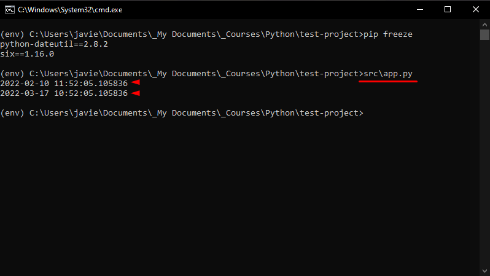

# Virtual environment creation process (on Windows):

Create a folder in any desired direction, I created mine in the `documents/` folder and named it `test-project`.


Next, use the Windows command prompt to navigate to the folder's location, and execute the command `py -m venv env`.


A folder named `env` should appear in your root directory.  


Overall directory structure:
```
env/
├── Include/
├── Lib/
│   └── site-packages/
│       └── (Lots of files.)
└── Scripts/
    ├── activate
    ├── activate.bat
    ├── Activate.ps1
    ├── deactivate.bat
    ├── pip.exe
    ├── pip3.10.exe
    ├── pip3.exe
    ├── python.exe
    └── pythonw.exe
```

Now, we should start the virtual environment using the file named `activate` inside the `env/Scripts/` folder.


Then, `(env)` should be displayed in the command prompt.


And, we can use the `pip freeze` command to display the installed packages.


Which are none at the moment since we just created or virtual environment. We can change that quickly by installing the dateutil package running the command `pip install python-dateutil`.


Running the `pip freeze` command once more should display the packages installed.


Next, in order to test the installed packages, I've created an `app.py` file inside my root directory.  

```
test-project/
├── env/
│   └── (Lots of files.)
└── src/
    └── app.py <-- Here.
```

Here is the [code](src/app.py) inside the `app.py` file, in case you want to try it yourself.


To run the code we should navigate to the `src/` folder and then look for the `app.py` file, hit enter, and two ouputs should appear in the command prompt:
1. An output displaying the current date.
2. An output displaying the current date ahead by one month, one week, and the hours set to ten.



Finally, to exit the virtual environment you just need to navigate (once again) to `env/Scripts/` and run `deactivate.bat`.


👏 Congratulations! if you followed until the end, you have just set up a Python's virtual enviroment.
